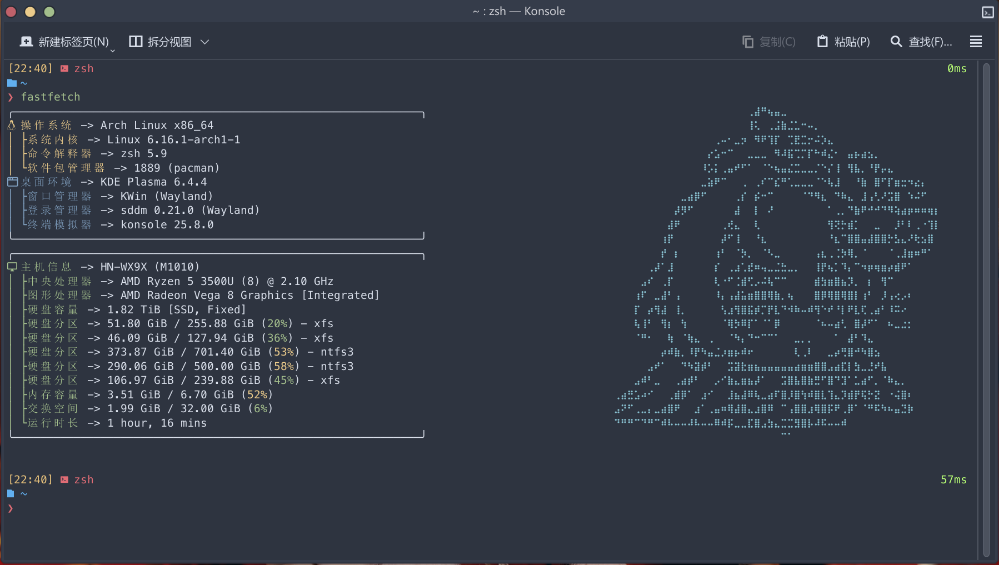

# fastfetch config

### Screenshot

### Usage

* ``git clone https://github.com/SilverWolfOfficial/fastfetch-config.git fastfetch``
* Paste the folder to ``~/.config``

![screenshot-02](./screenshot-02.png
